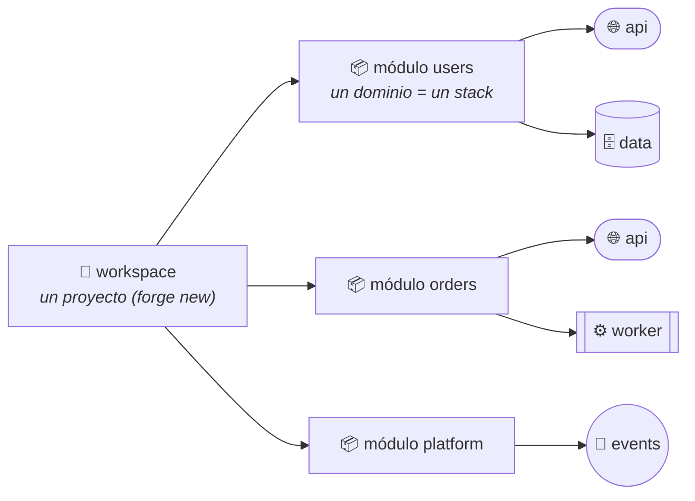

# Guía de uso de forge

forge es a la infraestructura lo que Angular CLI o Vite son al frontend: tú
pides las piezas (`new`, `generate`) y el CLI es dueño de la estructura, las
buenas prácticas y el cableado. Tú escribes lógica de negocio.

## 1. El modelo mental



| Concepto | Analogía frontend | Qué es en forge |
|---|---|---|
| **Workspace** | el proyecto de Vite/Angular | Carpeta creada por `forge new`: manifiesto (`forge.json`), dominios, toolchain lista |
| **Módulo** | `ng generate module` | Un **dominio de negocio** (`users`, `orders`, `billing`). Cada uno se despliega como stack independiente |
| **Componente** | `ng generate component` | Una pieza de arquitectura dentro del dominio: API, worker, tabla, bucket, bus… |
| **Endpoint** | una ruta + controller | Ruta de API + controller + use case + test, acoplados a la lambda API del dominio |
| **Acople** | inyección de dependencias | Binding (IAM mínimo + env var) o suscripción a eventos, declarado — nunca cableado a mano |

**La regla de oro:** un módulo es un *dominio de negocio*, no una capa técnica.
Cada dominio con API tiene **su propia** lambda (`api`) con **sus** endpoints —
así `forge deploy users` jamás toca `orders`. Lo único legítimamente
compartido es el **event-bus** (típicamente en un módulo `platform`): los
dominios publican y se suscriben a él por nombre, sin acoplarse entre sí.

> ❌ `forge generate module shared` con "el API base" de todos
> ✔️ `forge generate module platform` con el `event-bus` compartido
> ✔️ un `http-api` llamado `api` **dentro de cada dominio** que exponga rutas

## 2. Crear un proyecto

```bash
forge new mi-app                          # interactivo: pregunta blueprint
forge new mi-app --blueprint event-driven # o directo desde una arquitectura de referencia
forge new mi-app --engine azure-terraform # Azure en vez de AWS (default: aws-cdk)
cd mi-app                                 # deps ya instaladas (pnpm)
```

Blueprints disponibles (`forge blueprints`): `serverless-api`,
`queue-processing`, `scheduled-tasks`, `web-app`, `event-driven`.

## 3. Módulos y componentes

```bash
forge generate module users
forge generate component api --module users --type http-api
forge generate component data --module users --type table --partition-key userId
```

En una terminal, forge **infiere los acoples y pregunta** ("¿qué componentes
usarán `data`?"); cada pregunta tiene su flag gemelo para scripts/CI:

```bash
forge generate component data --module users --type table --attach api:read-write --no-interactive
```

Tipos de componente y a qué se traducen:

| Tipo | AWS | Azure |
|---|---|---|
| `http-api` | API Gateway REST + Lambda (fusion) | *(fase 1b — llega con fusion-azure)* |
| `function` | Lambda (+ schedule, + eventos) | Function App (+ timer, + Event Grid) |
| `queue-worker` | SQS + DLQ + Lambda | Service Bus queue + DLQ + Function App |
| `table` | DynamoDB on-demand | Cosmos DB serverless |
| `bucket` | S3 privado y cifrado | Blob container |
| `topic` | SNS | Service Bus topic |
| `event-bus` | EventBridge | Event Grid topic |
| `static-site` | S3 + CloudFront (+WAF) | *(fase 1b — Front Door)* |

## 4. Endpoints (el API de cada dominio)

```bash
forge generate endpoint get-user --module users --method GET --route /users/{id}
forge generate endpoint create-user --module users --method POST --route /users
```

Cada endpoint genera y mantiene en sincronía: la **ruta en API Gateway**
(`component.json`), un **controller** fusion (adaptador — solo traducción), un
**use case** (`src/application/<nombre>.uc.ts` — **aquí va tu lógica**) y un
**test**. Los controllers se registran en un barrel que forge regenera; nunca
edita tu código a mano.

```
domains/users/components/api/
  src/
    handler.ts                      # composition root (no tocar lógica aquí)
    application/get-user.uc.ts      # 👈 tu lógica de negocio
    domain/ports/                   # interfaces que tu lógica necesita
    infrastructure/
      controllers/get-user.controller.ts
      adapters/                     # implementaciones reales de los ports
```

## 5. Acoples: bindings y eventos

**Bindings** (mismo dominio): acceso de mínimo privilegio + variable de
descubrimiento inyectada al consumidor.

```bash
forge attach api --module users --bind data:read-write
# → IAM/RBAC mínimo + process.env.TABLE_DATA_NAME en la lambda api
```

Accesos: `read`, `write`, `read-write` (tablas/buckets) · `publish`
(colas/topics/buses).

**Eventos** (entre dominios): la ÚNICA forma de cruzar dominios es un
`event-bus`, referenciado como `dominio/bus`:

```bash
# orders publica; billing reacciona desde su propia cola
forge attach api --module orders --bind platform/events:publish
forge generate component processor --module billing --type queue-worker \
  --subscribe platform/events:source=orders
```

`queue-worker` para procesamiento confiable (retries + DLQ); `function`
suscrita para reacciones ligeras sin DLQ.

**Ciclo de vida completo:**

```bash
forge attach <comp> -m <mod>        # acoplar (interactivo sin flags)
forge detach <comp> -m <mod>        # desacoplar (checkbox de acoples actuales)
forge remove endpoint get-user -m users
forge remove component data -m users          # se niega si alguien la usa
forge remove component data -m users --force  # desacopla referentes primero
```

## 6. Ver, testear, desplegar

```bash
forge list                    # arquitectura en la terminal
forge docs                    # regenera docs/architecture.md (Mermaid) — también
                              #   se actualiza solo con cada new/generate/attach
forge test users              # unit tests + snapshot de infraestructura del dominio
forge test users --update     # aceptar un cambio de infra intencional
forge diff users --env dev    # qué cambiaría
forge deploy users --env dev  # despliega SOLO ese dominio
forge deploy --all --env dev  # todo, solo si lo pides explícito
```

Requisitos por motor:
- **aws-cdk**: credenciales AWS + `cdk bootstrap` una vez por cuenta/región.
- **azure-terraform**: binario `terraform` + `az login`. El estado es local
  (`.tfstate/`) por ahora; backend remoto para equipos llega con
  `forge bootstrap` (fase 1b).

## 7. Convenciones que te ahorran problemas

- Nombres **kebab-case** (`user-events`, no `userEvents`).
- Un `http-api` por dominio, llamado `api`. Las rutas crecen con
  `generate endpoint`, no creando más APIs.
- Variables de ruta consistentes: si ya existe `/users/{id}`, no crees
  `/users/{userId}` (forge lo rechaza — API Gateway no lo permite).
- La lógica vive en `application/`; los adaptadores (`infrastructure/`) solo
  traducen. Si tu use case necesita el mundo exterior, defínele un port.
- No edites `component.json` para cosas que un comando hace mejor: el comando
  valida y hace rollback si algo queda inválido.

## 8. Problemas comunes

| Síntoma | Causa | Solución |
|---|---|---|
| `Snapshots 1 failed` tras generar algo | El template de infra cambió (esperado) | `forge test <mod> --update` |
| `Multiple modules found…` al deploy | Protección anti-"deploy todo sin querer" | Nombra el módulo o pasa `--all` |
| `Component … is still used by…` al remove | Otros componentes lo referencian | `forge detach` primero o `--force` |
| `Terraform CLI not found` | Falta el binario (Azure) | Instálalo; forge lo maneja desde ahí |
| `no prompts en CI` | Diseñado así (sin TTY no pregunta) | Usa los flags `--bind/--attach/--subscribe` |
| Error con pista `↳` | Todo error de forge trae su cómo-arreglarlo | Léela: es la solución |
